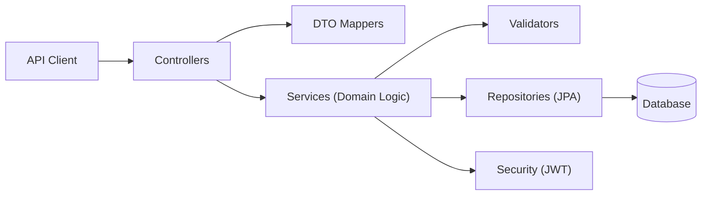

# Bookstore E‑commerce API

[](https://github.com/paulopacifico/E-commerce_Book_Store/actions/workflows/maven.yml)


## Overview
A production‑minded Spring Boot backend for a digital bookstore. The system focuses on secure transactions, inventory management, and clean, maintainable architecture. It’s designed to be easy to run locally (H2) or in Docker with PostgreSQL, and it ships with a full Postman collection for API exploration.

## Highlights
- Stateless authentication with JWT and Spring Security
- Access + refresh token flow (`/api/auth/refresh`) with refresh token rotation
- In-memory request rate limiting on `/api/**` to reduce abuse
- Hardened CORS via explicit allow-list configuration properties
- Audit logging for critical auth/admin/order operations
- Input sanitization guard (`@NoHtml`) on user-controlled text fields
- Clean separation between API DTOs and domain logic
- Cart and order workflows with validation and stock checks
- Docker + PostgreSQL profile for containerized runs
- Idempotent PostgreSQL seed runner (`docker` profile)
- Consistent API error envelope and stable pagination DTO responses
- Postman collection + environment included

## Tech Stack
- **Language/Runtime:** Java 21
- **Framework:** Spring Boot 4.0.2
- **Security:** Spring Security, JWT (jjwt 0.12.3)
- **Persistence:** Spring Data JPA, H2 (local), PostgreSQL (Docker)
- **Build:** Maven
- **Testing:** JUnit 5, Mockito, Spring Test

## Architecture
- **Controllers:** Handle HTTP contracts and DTO mapping
- **Services:** Domain logic, validation, and orchestration (DTO‑free)
- **Repositories:** Data access via Spring Data JPA
- **Mappers/Validators:** Dedicated mapping and validation helpers

## Architecture Diagram


## Local Run (H2)
**Prerequisites**
- JDK 21+
- Maven 3.9+

**Run**
```bash
git clone https://github.com/paulopacifico/E-commerce_Book_Store.git
cd E-commerce_Book_Store
mvn clean install
mvn spring-boot:run
```
API will be available at `http://localhost:8080`.

## Docker Run (PostgreSQL)
```bash
docker compose up --build
```
API will be available at `http://localhost:8080`.

## Postman
Postman assets are in `postman/`:
1. Import `postman/bookstore.postman_environment.json`
2. Import `postman/bookstore.postman_collection.json`
3. Select **Bookstore Local** environment

The **Login** and **Refresh Token** requests store:
- `{{authToken}}` (access token)
- `{{refreshToken}}` (refresh token)

## OpenAPI
- Static OpenAPI spec: `docs/openapi.yaml`
- Import into Postman as an API definition or use as contract documentation.
- Runtime OpenAPI JSON: `/v3/api-docs`
- Runtime Swagger UI: `/swagger-ui.html` (or `/swagger-ui/index.html`)

## Testing
```bash
mvn test
```
## Troubleshooting
- Access documentation and endpoints via:
  - Swagger UI: `http://localhost:8080/swagger-ui.html`
  - OpenAPI JSON: `http://localhost:8080/v3/api-docs`
  - Public APIs: `http://localhost:8080/api/books` and `http://localhost:8080/api/categories`

## CI
GitHub Actions runs the test suite on JDK 21.

## API Modules
- **Auth:** register, login, refresh token
- **Books:** search, list, get, admin CRUD
- **Categories:** list, get, admin CRUD
- **Cart:** add/update/remove/clear, summary totals
- **Orders:** checkout, list, get by id

## Response Contracts
- **Paged endpoints (`/api/books`, `/api/books/search`, `/api/books/category/{id}`):**
  return `PageResponse<T>` with: `content`, `page`, `size`, `totalElements`, `totalPages`, `first`, `last`, `hasNext`, `hasPrevious`.
- **Error responses (all endpoints):**
  return `ApiErrorResponse` with: `status`, `error`, `message`, `path`, `timestamp`, and optional `errors` map for validation failures.

## Security Hardening Config
- **Rate limit properties:** `app.security.rate-limit.max-requests`, `app.security.rate-limit.window-seconds`
- **CORS properties:** `app.security.cors.allowed-origins`, `allowed-methods`, `allowed-headers`, `exposed-headers`, `allow-credentials`, `max-age`

## Author
**Paulo Pacifico**  
Backend Java Developer
